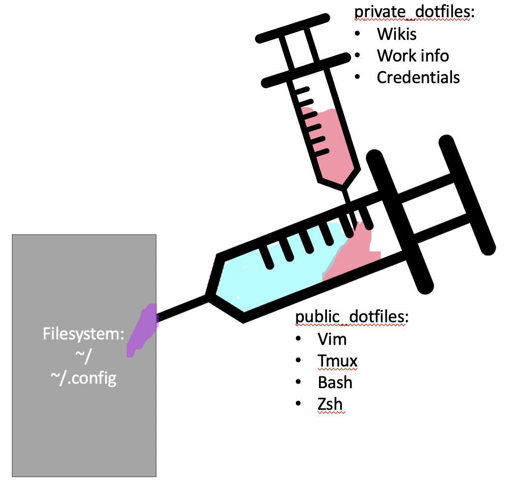

# Public Dotfiles
My public version of dotfiles for the general public to see. Uses GNU `stow` a 
symlink farm manager to "stow" packages into the file-system (creates a bunch of 
symlinks that point back to this repo), that are easily "unstowed" at will. 
For an analogy, think of a syringe that can "inject" dotfiles into the file-system, 
similar to how syringes are used to inject medicine into the blood stream. In 
this case however, the syringe is magical and it can "uninject" each and every 
symlink it previously injected. For more details see [Stow](https://www.gnu.org/software/stow/).

## Private Dotfiles
What you don't see in this repo is that `public_dotfiles` is actually a `git submodule` within my `private_dotfiles` repository that is hidden to the public. My `private_dotfiles` repo actually stows all of its packages into `public_dotfiles` before `public_dotfiles` stows its packages into the file-system. So to continue with the analogy, a syringe with a super-secret concoction injects its contents into that of ANOTHER syringe, which injects its mixed contents into the file-system. Complicated much? Maybe, but I think it's cool! (Works fine as long as all the syringes are "uninjected" back in the right order)

<p align="center">  </p>

Based on [Kraymer's dotfiles](https://github.com/Kraymer/F-dotfiles), which supplies a nifty way of formatting dotfiles in a way that facilitates readability.

## Dependencies 
- `stow 2.3` - GNU Stow, a symlink farmer, acts as the package deployment system.
- An older version can be used, but be sure to manually an absolute path for `--target` in `stow/.stowrc`
    - MacOS with Homebrew: 
    ```bash
    brew install stow
    ```
    - Ubuntu: 
    ```bash
    sudo add-apt-repository ppa:dns/gnu
    sudo apt-get update
    sudo apt-get install stow

    # OR if you are willing to manually set an absolute path for "--target" in "stow/.stowrc"
    # then the default older version is fine:
    sudo apt-get install stow
    ```
    - Arch Linux: 
    ```bash
    pacman -S stow
    ```

## Optional Dependencies 
- `tree 1.8.0` + `python 3` if you plan on using the `__dev` tools for yourself.

## Install Packages
_Or "stow packages"_
```bash
git clone https://github.com/scagle/dotfiles.git ~/.dotfiles
cd ~/.dotfiles

# creates ~/.config if needed and stows "stow/" first which is VERY IMPORTANT.
./initialize.sh

stow <package-directory>
stow bash
stow vim_plus
# ...

# OR name a group when initializing (read initialize.sh for all groups):
./initialize.sh mac_common
```

## Uninstall Packages
_Or "unstow packages"_
```bash
cd ~/.dotfiles

# MAKE SURE YOU UNSTOW ANY SUBPACKAGES FIRST
stow -D <package-directory>
stow -D bash
stow -D vim_plus
# ...

# OR Automatically unstow all stowed packages in the right order:
./unstow_all.sh  
```
### Naming Conventions
[Kraymer's dotfiles](https://github.com/Kraymer/F-dotfiles) supplied a format for naming packages to make 
it easier for the reader to understand what's going on. I kept the structure but changed the naming 
scheme a bit, since I do not personally like symbols like `@` being used in filenames.
- lowercase for packages that are installed in `$HOME` 
    - (EX: [`bash`](https://github.com/scagle/dotfiles/blob/master/bash/))
- titlecase for packages that must be called with `sudo stow -d / <package-directory>` to install in `/` 
    - (EX: `SomeDaemonWhichIHaveNotCreatedYet`)
- `_plus` suffix or a `_plus_`<sup>[1]</sup> for packages that also contain subpackages
    - (EX: [`vim_plus`](https://github.com/scagle/dotfiles/blob/master/vim_plus/))
- `_sub` suffix or a `_sub_`<sup>[1]</sup> for subpackages 
    - (EX: [`vim_plus/nvim_sub`](https://github.com/scagle/dotfiles/blob/master/vim_plus/nvim_sub))
- `_init` suffix or a `_init_`<sup>[1]</sup> for packages that also contain `initialization.sh` scripts
    - (EX: [`tmux_init`](https://github.com/scagle/dotfiles/blob/master/tmux_init), [`zsh_init`](https://github.com/scagle/dotfiles/blob/master/zsh_init))
- `_` prefix for environment/system-specific packages
    - (EX: [`_mac`](https://github.com/scagle/dotfiles/blob/master/_mac/), [`_linux`](https://github.com/scagle/dotfiles/blob/master/_linux/))
- `__` prefix for non packages meaning that these directories **MUST NOT BE STOWED** 
    - (EX: [`__dpkg`](https://github.com/scagle/dotfiles/blob/master/__dkpg), [`__homebrew`](https://github.com/scagle/dotfiles/blob/master/__homebrew)) 

### Secret files 

> Files that contain sensitive information and should not be published are kept secret ~~using package specific `.gitignore` files~~.  
> These files are prominently listed in the package `README.md` with a ✏ symbol aside.  
> Because the secret file itself is not tracked, a template is commited instead having same name but with the `.local` suffix appended. This template is intended to serve as a base for edition and can be renamed (removing the suffix) after its content is edited
- In reality I leave a `.local` or a `dir.local` file to indicate the spots where I "inject" `private_dotfiles` packages into the `public_dotfiles`. 
    - `.local` indicates a __file__ is missing. (EX: [`work.rc.local`](shell/..config/shell/work.rc.local))
    - `.dir.local` indicates a __directory__ is missing. (EX: [`vimwiki.dir.local`](vim_plus/vimwiki_sub/vimwiki.dir.local))

[1] - Allows for combinations, so "package_init_sub_plus" would work (although in retrospect that looks ridiculous :weary:).
